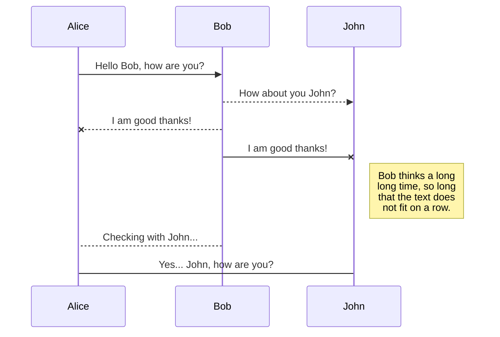
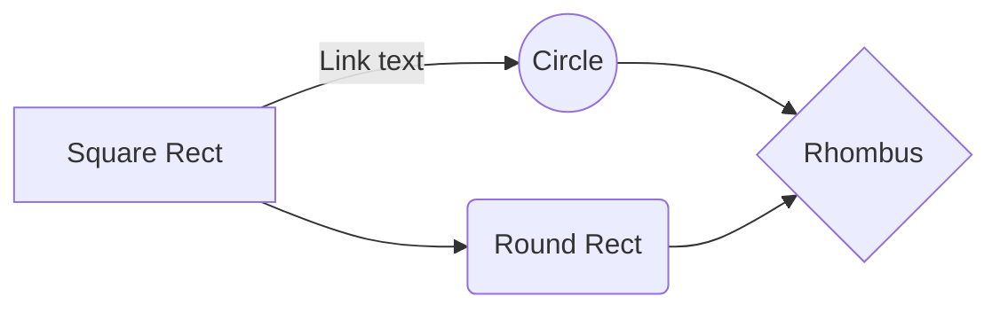

# **Chavas frescas**

  

   

En este repositorio nuestro equipo las " Chavas frescas" desglosaremos como logramos crear un robot para participar en la World Robot Olympiad en la categoria de Future Engineers.

  

# Contenido del repositorio

  
*  `models` — contiene los modelos 3D de nuestro robot.

*  `schemes` — contiene el esquema de conexiones del robot y un diagrama de flujo del codigo.

*  `src` — contiene el codigo de nuestro robot.

*  [`t-photos`](t-photos) — continene fotos de los integrantes del equipo.

*  `v-photos` — contiene seis fotos del carrito.

*  `research` — una seccion dedicada a temas que investigamos en el proceso de crear el robot.

*  `video` — contiene un archivo markdown con los links de los videos demostrativos de nuestro robot.

*  `other` — contiene imagenes y archivos que ayudan a entender más a fondo como preparar el robot para la competencia, contiene datasheets y imagenes de los componentes.

  

# Tabla de contenidos

  

blah blah indice **offline!**

  

# Equipo

  

//foto de todos juntos

//descripcion y foto individual de cada uno

  

# ¿En que consiste la competencia?

  

La World Robot Olympiad es una competencia mundial de robótica que busca una competencia sana para jóvenes, alentando el aprendizaje y la curiosidad.

En nuestro caso participamos en la categoría de Future Engineers, en la cual existen dos pruebas, la prueba abierta y la prueba de obstáculos. En la prueba abierta nuestro vehículo debe completar exitosamente tres vueltas a la pista. En la prueba de obstáculos además de dar tres vueltas a la pista el robot debe de ir esquivando obstáculos y al final estacionarse en paralelo. En ambas pruebas existen elementos aleatorios como la posición de los obstáculos y el sentido de las vueltas, además de limitaciones para el robot.

  

# Fotos del robot

  

//foto de la derecha

//foto de la izquierda

//foto de arriba

//foto de abajo

//foto de enfrente

//foto de atras

  

# Videos del robot

  

//video de la prueba abierta

//video de la prueba de obstaculos

  

Los vídeos de rendimiento deben demostrar el rendimiento del vehículo de principio a fin para cada desafío. Los vídeos pueden incluir comentarios, títulos o animaciones. El vídeo también puede incluir aspectos de las secciones 1(gestion de movilidad), 2(gestion de la potencia y los sentidos) o 3(gestion de obstaculos)

  

# Hardware

  

**Esp32-WROVER**
Es un Single Board Microcontroller (SBM), es un sistema en chip (SoC) económico y de bajo consumo que combina funciones Wi-Fi y Bluetooth. Desde una perspectiva técnica, el ESP32 es un MCU de 32 bits con un microprocesador Tensilica Xtensa LX6, con una velocidad de reloj de hasta 240 MHz, 448 KB de ROM y 520 KB de SRAM. También incluye una amplia selección de periféricos, como un ADC de 10 bits, 6x PWM, I₂C, SPI, UART y más. La programación del ESP32 es relativamente sencilla, ya que admite diversos lenguajes de programación, como C/C++, ensamblador y Python. También es compatible con el IDE de Arduino, una popular plataforma de código abierto para la programación de microcontroladores.

Su función en nuestro proyecto es hacer de motor controller y obtener lecturas precisas de los sensores, dada a la rápida comunicación que tiene entre componentes. Elegimos al Esp32 sobre la opción clásica que sería algún arduino, ya que después de analizar ambos llegamos a la conclusión que el esp32 es mejor. 
<table>
  <tr>
    <td width="20%" style="text-align: left;">
      
    </td>
    <td width="80%" style="text-align: left; vertical-align: center;">
      <h3>Especificaciones:</h3>
      <li>Voltaje: 2.3V ~ 3.6V</li>
      <li>Amperaje: 80mA ~ 250mA </li>
      <li>Peso: 6.8 gramos</li>
      <li>Dimensiones: (18.00±0.10) mm × (31.40±0.10) mm × (3.30±0.10) mm</li>
      </li>
    </td>
  </tr>
</table>

**Raspberry Pi 4 Model B**

  

**Servomotor MG995 180°**

  

**Motor JGB37-520 DC 12v 178rpm con encoder**

  

**Motor driver TB6612FNG**

  

**Cámara OV5647**

  

**Sensor Ultrasónico HC-SR04**

  

**IMU MPU6050 6 Grados de libertad**

  

**Baterías 18650 3.7v 3000 mAh**

  

**BMS FTVOGUE 3S 12V**

  

**LM2596 Regulador Step Down 25W 3A**

  
  

## Reporte de costos

|Nombre| Cantidad | Costo por unidad | Costo total |

|--|--| -- | -- |

| Esp32-WROVER | | | |

| Raspberry Pi 4 Model B | | | |

| Servomotor MG995 180° | | | |

| Motor JGB37-520 DC 12v 178rpm con encoder | | | |

| Motor driver TB6612FNG | | | |

| Cámara OV5647 | | | |

| Sensor Ultrasónico HC-SR04 | | | |

| IMU MPU6050 6 Grados de libertad | | | |

| Batería 18650 3.7v 3000 mAh | | | |

| BMS FTVOGUE 3S 12V | | | |

| LM2596 Regulador Step Down 25W 3A | | | |

otras cosas ...

  

# Mobility Management

  

blah blah

  

# Power and Sense Management

  

blah blah

  

# Software

  

blah blah

  

# Obstacle Management

  

blah blah

  

# Robot Construction Guide

  

blah blah

  

# Our journey

  

blah blah

  

....

cosas de la plantilla

  

Publishing in StackEdit makes it simple for you to publish online your files. Once you're happy with a file, you can publish it to different hosting platforms like **Blogger**, **Dropbox**, **Gist**, **GitHub**, **Google Drive**, **WordPress** and **Zendesk**. With [Handlebars templates](http://handlebarsjs.com/), you have full control over what you export.

  

> Before starting to publish, you must link an account in the **Publish** sub-menu.

  

## Publish a File

  

You can publish your file by opening the **Publish** sub-menu and by clicking **Publish to**. For some locations, you can choose between the following formats:

  

- Markdown: publish the Markdown text on a website that can interpret it (**GitHub** for instance),

- HTML: publish the file converted to HTML via a Handlebars template (on a blog for example).

  

## Update a publication

  

After publishing, StackEdit keeps your file linked to that publication which makes it easy for you to re-publish it. Once you have modified your file and you want to update your publication, click on the **Publish now** button in the navigation bar.

  

>  **Note:** The **Publish now** button is disabled if your file has not been published yet.

  

## Manage file publication

  

Since one file can be published to multiple locations, you can list and manage publish locations by clicking **File publication** in the **Publish** sub-menu. This allows you to list and remove publication locations that are linked to your file.

  
  

# Markdown extensions

  

StackEdit extends the standard Markdown syntax by adding extra **Markdown extensions**, providing you with some nice features.

  

>  **ProTip:** You can disable any **Markdown extension** in the **File properties** dialog.

  
  

## SmartyPants

  

SmartyPants converts ASCII punctuation characters into "smart" typographic punctuation HTML entities. For example:

  

| |ASCII |HTML |

|----------------|-------------------------------|-----------------------------|

|Single backticks|`'Isn't this fun?'` |'Isn't this fun?' |

|Quotes |`"Isn't this fun?"` |"Isn't this fun?" |

|Dashes |`-- is en-dash, --- is em-dash`|-- is en-dash, --- is em-dash|

  
  

## KaTeX

  

You can render LaTeX mathematical expressions using [KaTeX](https://khan.github.io/KaTeX/):

  

The *Gamma function* satisfying $\Gamma(n) = (n-1)!\quad\forall n\in\mathbb N$ is via the Euler integral

  

$$

\Gamma(z) = \int_0^\infty t^{z-1}e^{-t}dt\,.

$$

  

> You can find more information about **LaTeX** mathematical expressions [here](http://meta.math.stackexchange.com/questions/5020/mathjax-basic-tutorial-and-quick-reference).

  
  

## UML diagrams

  

You can render UML diagrams using [Mermaid](https://mermaidjs.github.io/). For example, this will produce a sequence diagram:

  

  

And this will produce a flow chart:

  

