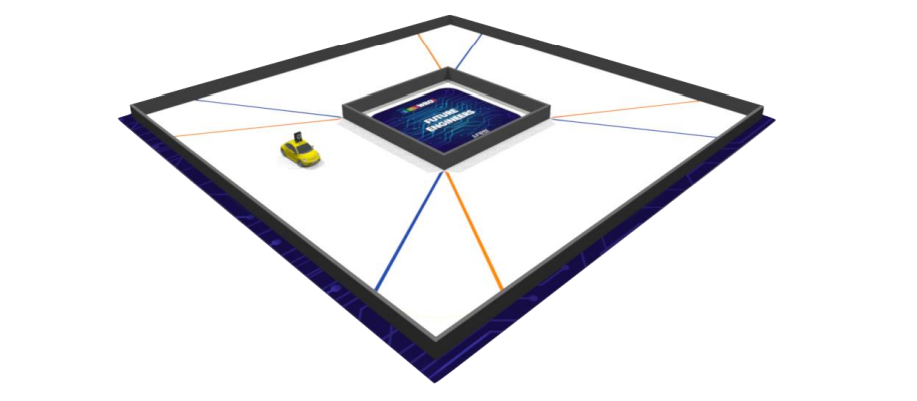
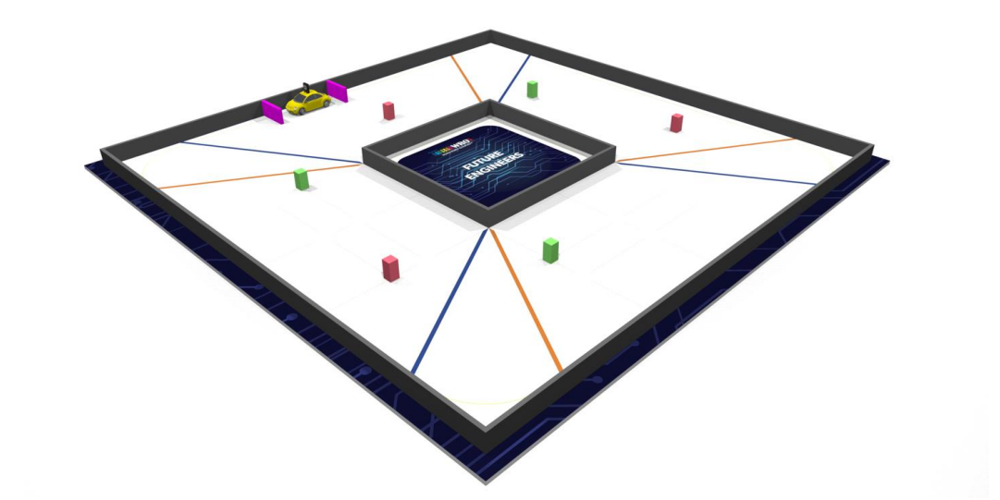
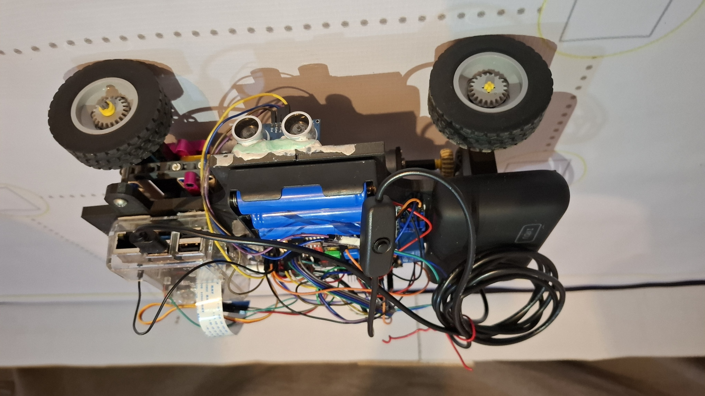
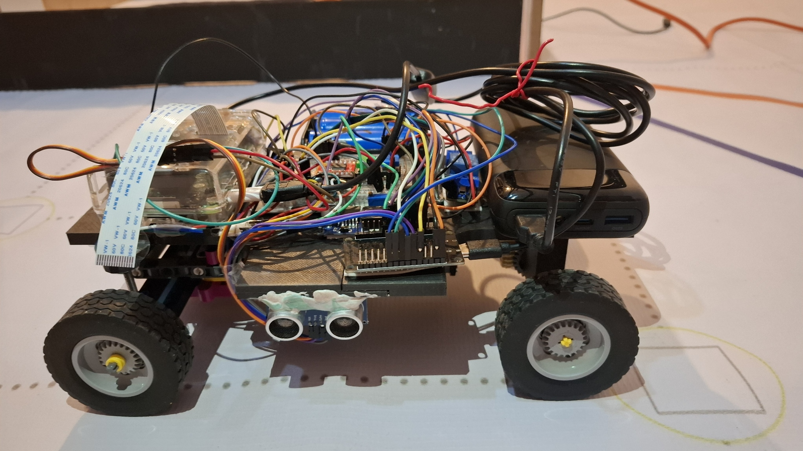
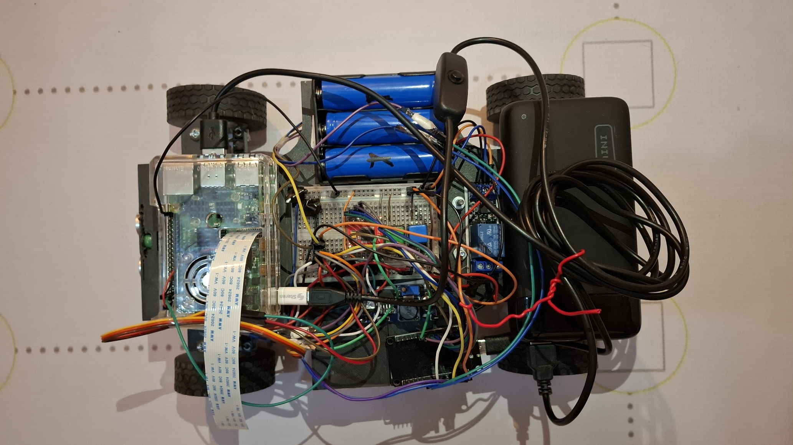
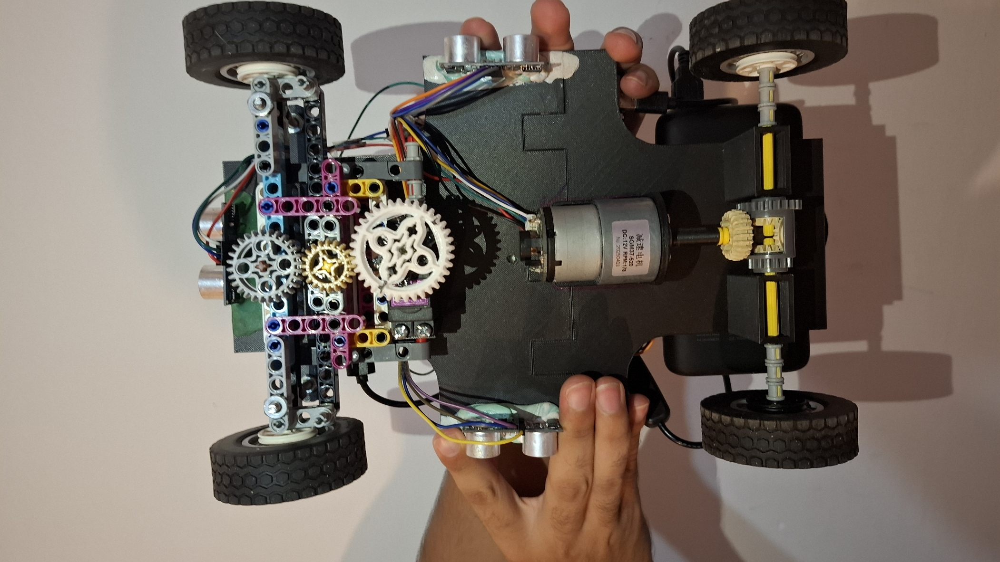
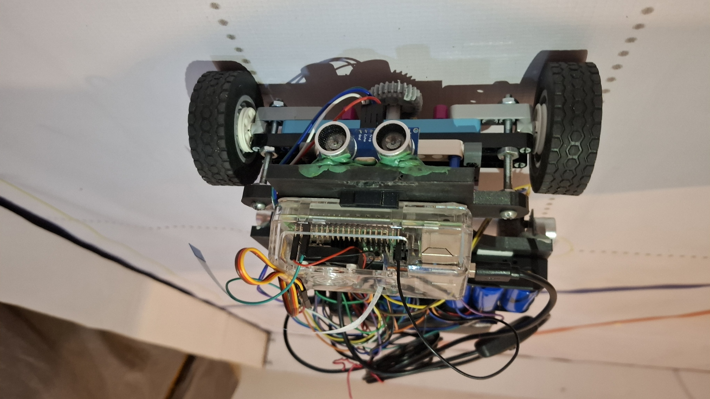
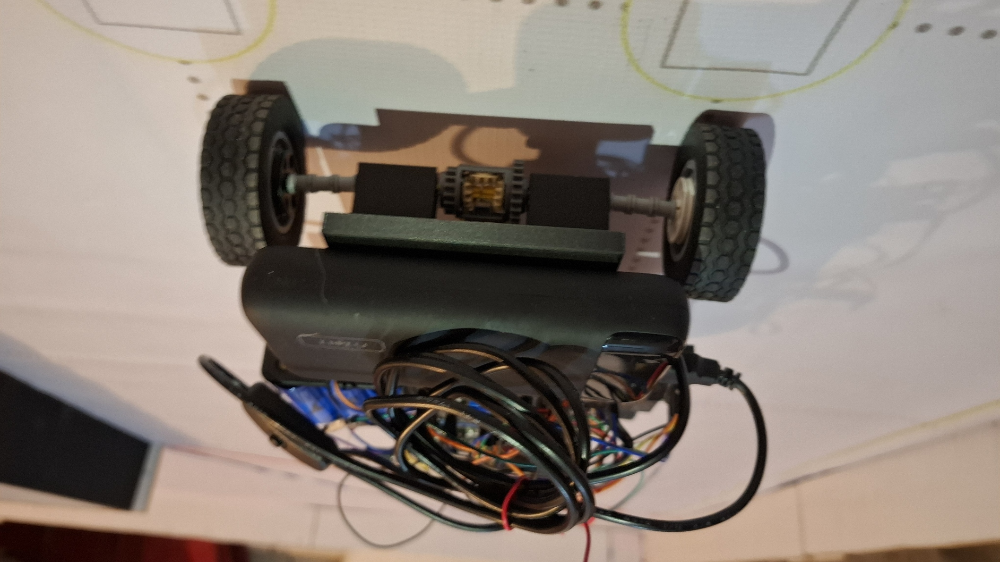
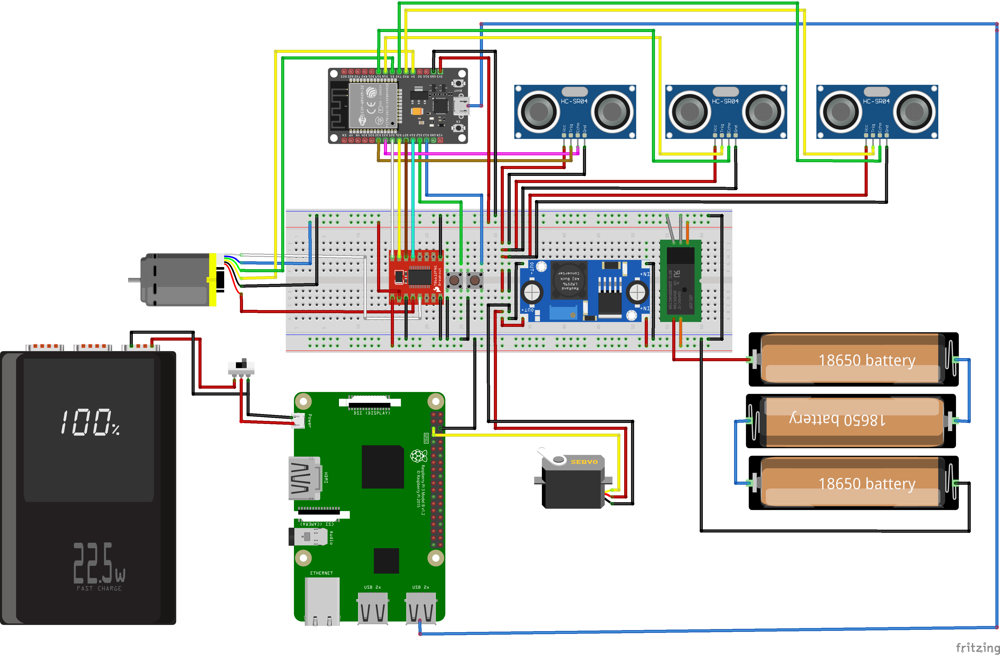

 

 

En este repositorio nuestro equipo "Chavas frescas" desglosaremos como logramos crear un robot para participar en la World Robot Olympiad en la categoria de Future Engineers.

&nbsp;

# Tabla de contenidos
* **[Contenido del repositorio](#contenido-del-repositorio)**
* **[¿En que consiste la competencia?](#en-que-consiste-la-competencia)**
* **[Equipo](#equipo)**
* **[Fotos del robot](#fotos-del-robot)**
* **[Hardware](#hardware)**
  * [Componentes](#componentes)
  * [Reporte de costos](#reporte-de-costos)
* **[Mobility Management](#mobility-management)**
  * [Diseño del chasis](#diseño-del-chasis) 
  * [Elección de motores](#eleccion-de-motores) 
* **[Power and Sense Management](#power-and-sense-management)**
  * [Voltaje y amperaje](#voltaje-y-amperaje) 
  * [Esquema](#esquema) 
  * [Sensores](#sensores) 
* **[Software](#software)**
  

&nbsp;

# Contenido del repositorio
  
*  [`models`](models) — contiene los modelos 3D de nuestro robot.

*  [`schemes`](schemes) — contiene el esquema de conexiones del robot y un diagrama de flujo del codigo.

*  [`src`](src) — contiene el codigo de nuestro robot.

*  [`t-photos`](t-photos) — continene fotos de los integrantes del equipo.

*  [`v-photos`](v-photos) — contiene seis fotos del carrito.

*  [`other`](other) — contiene imagenes y archivos que ayudan a entender más a fondo como preparar el robot para la competencia, contiene datasheets y imagenes de los componentes.

&nbsp;

# ¿En que consiste la competencia?

La World Robot Olympiad es una competencia mundial de robótica que busca una competencia sana para jóvenes, alentando el aprendizaje y la curiosidad.

En nuestro caso participamos en la categoría de Future Engineers, el objetivo es construir un vehículo autodirigido con algunas limitaciones(como peso, tamaño y número de motores), el cual debe de ser capaz de pasar dos pruebas.

Prueba abierta.

Prueba de obstáculos. 

En la prueba abierta nuestro vehículo debe completar exitosamente tres vueltas a la pista. En la prueba de obstáculos además de dar tres vueltas a la pista el robot debe de ir esquivando obstáculos y al final estacionarse en paralelo. En ambas pruebas existen elementos aleatorios como la posición de los obstáculos y el sentido de las vueltas, estos elementos cambian después de cada ronda. Para conocer más puede leer las [reglas generales](https://wro-association.org/wp-content/uploads/WRO-2022-Future-Engineers-General-Rules.pdf) o visitar el [sitio oficial](https://wromexico.org/). 

&nbsp;

# Equipo

Integrantes del equipo:
- Hanna Alejandra Amador Sánchez
- Ilse Marianne Castillo Pimienta
- Yonatan Morales Togo
  
&nbsp;

# Fotos del robot

&nbsp;  

# Videos del robot
Aqui esta el [link](https://youtu.be/UbjT6czdM9U?si=_D7zrM3F1YbVgJT3) para el video de nuestro robot.

# Hardware

## Componentes 

***Esp32*** 

Es un Single Board Microcontroller (SBM), es un sistema en chip (SoC) económico y de bajo consumo que combina funciones Wi-Fi y Bluetooth. Desde una perspectiva técnica, el ESP32 es un MCU de 32 bits con un microprocesador Tensilica Xtensa LX6, con una velocidad de reloj de hasta 240 MHz, 448 KB de ROM y 520 KB de SRAM. También incluye una amplia selección de periféricos, como un ADC de 10 bits, 6x PWM, I₂C, SPI, UART y más. La programación del ESP32 es relativamente sencilla, ya que admite diversos lenguajes de programación, como C/C++, ensamblador y Python. También es compatible con el IDE de Arduino, una popular plataforma de código abierto para la programación de microcontroladores. Para ver mas información puede ver el [datasheet](other/Datasheets/esp32-wrover_datasheet_en.pdf) y la descripción de los [pines GPIO](other/img/ESP32-Pinout.jpg).

Su función en nuestro proyecto es hacer de motor controller y obtener lecturas precisas de los sensores, dada a la rápida comunicación que tiene entre componentes. Elegimos al Esp32 sobre la opción clásica que sería algún arduino, ya que después de analizar ambos llegamos a la conclusión que el Esp32 es mejor. 
<table>
  <tr>
    <td width="400px" style="text-align: center;">
      
    </td>
    <td width="500px" style="text-align: left; vertical-align: center;">
      <h3>Especificaciones:</h3>
      <li>Voltaje: 2.3V ~ 3.6V</li>
      <li>Amperaje: 80mA ~ 250mA </li>
      </li>
    </td>
  </tr>
</table>

 

***Raspberry Pi 4 Model B***

El Single-Board Computer (SBC), es un pequeño computador, consiste en una placa base que soporta distintos componentes de un ordenador, como un procesador ARM de hasta 1500 MHz, un chip gráfico y una memoria RAM de hasta 8 GB. Puede ver la configuración de los gpio pines en esta [imagen](other/img/pinesRaspberry.jpg), para ver más información consulte el [datasheet](other/Datasheets/raspberry-pi-4-product-brief.pdf).

Hace la función del cerebro principal del robot, esta a cargo de la computer vision interpretando los datos de la camara, ademas toma las decisiones importantes.

<table>
  <tr>
    <td width="400px" style="text-align: center;">
      
    </td>
    <td width="500px" style="text-align: left; vertical-align: center;">
      <h3>Especificaciones:</h3>
      <li>Voltaje: 5V</li>
      <li>Amperaje: 2500mA ~ 3000mA </li>
      </li>
    </td>
  </tr>
</table>

 

***Servomotor MG995 180°***

Un servomotor es un tipo de motor que permite controlar con precisión la posición, velocidad y aceleración de su eje. A diferencia de un motor eléctrico convencional, un servomotor utiliza un sistema de retroalimentación (como un encoder) para monitorear y corregir continuamente su movimiento, logrando un control más exacto. 

Usamos este servomotor para controlar la dirección del carro, decidimos usar este modelo de servomotor devido a su gran torque. Para más información consulte el [datasheet](other/Datasheets/Servomotor_MG995_datasheet.pdf).

<table>
  <tr>
    <td width="400px" style="text-align: center;">
      
    </td>
    <td width="500px" style="text-align: left; vertical-align: center;">
      <h3>Especificaciones:</h3>
      <li>Voltaje:  4.8V - 7.2V</li>
      <li>Amperaje: 200mA ~ 1200mA </li>
      <li>Torque: 9.4kg/cm (4.8V) - 11kg/cm (6V)</li>
      </li>
    </td>
  </tr>
</table>
  
 

***Motor JGB37-520 DC 12v con encoder***

Elegimos un motor de corriente continua, debido a su facilidad para usarlo. Estos motores toman la energía eléctrica mediante corriente continua y la convierten en rotación mecánica. Despues de calcular el [torque](/research/README.md) concluimos que ibamos a necesitar un motor con un buen torque para poder mover el robot. 

Este motor tambien cuenta con un encoder, el encoder nos ayuda a monitorear las el moviemiento del motor.

// gracias a el pudimos implementar un sistema [PID](/research/README.md) para corregir las variaciones de la 
// energia y contar un moviemiento consistente. 
 
 Si quieres saber un poco más del motor revisa esta [imagen](other/Datasheets/motor.webp).

<table>
  <tr>
    <td width="400px" style="text-align: center;">
      
    </td>
    <td width="500px" style="text-align: left; vertical-align: center;">
      <h3>Especificaciones:</h3>
      <li>Voltaje:  12V</li>
      <li>Amperaje: 120mA ~ 2300mA </li>
      <li>Torque: 6.5kg.cm (120mA) - 9kg.cm (2300mA)</li>
      <h3>Encoder</h3>
      <li>Voltaje: 3.3V</li>
      </li>
    </td>
  </tr>
</table>
  
 

***Motor driver TB6612FNG***

Un motor driver nos ayuda a controlar el motor con un voltaje más alto, controlando la velocidad y el sentido de giro. 

El driver para motores TB6612FNG posee dos puentes H, puede controlar hasta dos motores de DC con una corriente costante de 1.2A (3.2A pico). Dos señales de entrada (IN1 y IN2) pueden ser usadas para controlar el motor en uno de cuatro modos posibles: CW(giro en sentido de las manecillas del reloj), CCW (en contra de las manecillas), short-brake y stop. Las dos salidas de motores (A y B) pueden ser controladas de manera separada, la velocidad de cada motor es controlada mediante una señal PWM con una frecuencia de hasta 100kHz. El pin STBY cuando es puesto en HIGH coloca al motor en modo de standby. El driver posee diodos internos de protección.
Elegimos este motor driver debido a su gran eficiencia energética, su tamaño compacto, genera menos calor y su control preciso. Para saber más sobre este componente revise su [datasheet](other/Datasheets/TB6612FNG.pdf) y para ver el pinout vea la [imagen](other/img/tb6612fng-pinout.png).

<table>
  <tr>
    <td width="400px" style="text-align: center;">
      
    </td>
    <td width="500px" style="text-align: left; vertical-align: center;">
      <h3>Especificaciones:</h3>
      <li>Voltaje lógico (VCC): 2.7V - 5.5V</li>
      <li>Voltaje de motor (VM): 4.5V - 13.5V</li>
      <li>Corriente máxima por motor: 1.2A continuos / 3.2A pico</li>
      </li>
    </td>
  </tr>
</table>
  
 

***Cámara OV5647***

Usamos una mini cámara gran angular, esta se conecta directamente al raspberry. Para conocer mas detalles de la cámara puede ver el [datasheet](other/Datasheets/ov5647_full.pdf).
  
<table>
  <tr>
    <td width="400px" style="text-align: center;">
      
    </td>
    <td width="500px" style="text-align: left; vertical-align: center;">
      <h3>Especificaciones:</h3>
      <li>Video: 1080p a 30fps</li>
      <li>Campo de visión: 2.0 x 1.33 m a 2 m</li>
      </li>
    </td>
  </tr>
</table>
  
 

***Sensor Ultrasónico HC-SR04***

Los sensores de ultrasonidos o sensores ultrasónicos son detectores de proximidad que trabajan libres de roces mecánicos y que detectan objetos a distancias que van desde pocos centímetros hasta varios metros. El sensor emite una onda y mide el tiempo que la señal tarda en regresar. Más detalles en el [datasheet](other/Datasheets/HC-SR04-Ultrasonic.pdf).
En otras palabras el sensor ultrasónico nos permite saber con precision a que distancia se encuentran las paredes. 

<table>
  <tr>
    <td width="400px" style="text-align: center;">
      
    </td>
    <td width="500px" style="text-align: left; vertical-align: center;">
      <h3>Especificaciones:</h3>
      <li>Voltaje: 3.3V ~ 5V</li>
      <li>Amperaje: 15mA </li>
      <li>Rango: 2cm ~ 400cm </li>
      </li>
    </td>
  </tr>
</table>
  
 
 
***Baterías 18650 3.7v 3000 mAh***

La pila 18650 es una batería recargable Li-ion, que se parece mucho a la pila tipo AA convencional. Para este proyecto usamos 3 baterias 18650 de 3.7V en serie para obtener un voltaje total de 11.1V.

<table>
  <tr>
    <td width="400px" style="text-align: center;">
      
    </td>
    <td width="500px" style="text-align: left; vertical-align: center;">
      <h3>Especificaciones:</h3>
      <li>Voltaje: 3.7V</li>
      <li>Amperaje: 3000mA  </li>
      <li>Ciclos de vida: 300–500 ciclos </li>
      </li>
    </td>
  </tr>
</table>
  
 
  
***LM2596 Regulador Step Down***

El LM2596 es un Regulador Step Down de 25W y 3A que ofrece una solución eficiente para reducir el voltaje de entrada en un circuito. Diseñado para manejar corrientes de hasta 3A, este regulador puede aceptar un voltaje de entrada que varía de 4 a 35V y proporciona un voltaje de salida ajustable de 2 a 28V. Gracias a su potenciómetro (trimpot) multivuelta, puedes seleccionar fácilmente el voltaje de salida deseado, lo que lo convierte en una opción versátil para una variedad de aplicaciones electrónicas.

<table>
  <tr>
    <td width="400px" style="text-align: center;">
      
    </td>
    <td width="500px" style="text-align: left; vertical-align: center;">
      <h3>Especificaciones:</h3>
      <li>Voltaje de entrada: 4V-35V</li>
      <li>Voltaje de salida: 2V-30V </li>
      <li>Corriente de salida máxima: 3A</li>
      </li>
    </td>
  </tr>
</table>
  
 

## Reporte de costos

<table>
  <thead>
    <tr>
      <th align="center">Nombre</th>
      <th align="center">Cantidad</th>
      <th align="center">Costo</th>
    </tr>
  </thead>
  <tbody>
    <tr>
      <td>ESP32</td>
      <td>1</td>
      <td align="center">$200.00</td>
    </tr>
    <tr>
      <td>Raspberry Pi 4 Model B</td>
      <td>1</td>
      <td align="center">$2100.00</td>
    </tr>
    <tr>
      <td>Servomotor MG995 180°</td>
      <td>1</td>
      <td align="center">$155.00</td>
    </tr>
    <tr>
      <td>Motor JGB37-520 DC 12v con encoder</td>
      <td>1</td>
      <td align="center">$258.00</td>
    </tr>
    <tr>
      <td>Motor driver TB6612FNG</td>
      <td>1</td>
      <td align="center">$96.50</td>
    </tr>
    <tr>
      <td>Cámara OV5647</td>
      <td>1</td>
      <td align="center">$160.00</td>
    </tr>
    <tr>
      <td>Sensor Ultrasónico HC-SR04</td>
      <td>3</td>
      <td align="center">$49.00</td>
    </tr>
    <tr>
      <td>6 Baterías 18650 3.7v 3000 mAh con cargador</td>
      <td>1</td>
      <td align="center">$493.05</td>
    </tr>
    <tr>
      <td>LM2596 Regulador Step Down 25W 3A</td>
      <td>1</td>
      <td align="center">$60.00</td>
    </tr>
    <tr>
    <tr>
      <td>Botones</td>
      <td>1</td>
      <td align="center">$60.00</td>
    </tr>
    <tr>
    <tr>
      <td>Adaptador</td>
      <td>1</td>
      <td align="center">$40.00</td>
    </tr>
    <tr>
    <tr>
      <td><strong>Total</strong></td>
      <td></td>
      <td align="center"><strong>$3671.5</strong></td>
    </tr>
  </tbody>
</table>

+ impresion 3d y 
otras cosas..

&nbsp;

# Mobility Management

## Diseño del chasis

Nuestro carro es de tracción trasera, funciona con un motor de 12v que, con adaptador del motor a lego, transmite el movimiento a las llantas traseras. En la parte delantera para el sistema de giro optamos por un sistema sencillo, sin Ackermann. Adaptamos un soporte especial para la cámara, para el motor y para el servo. Los ultrasónicos los pegamos con plastiloka por facilidad.

Para realizar el diseño del chasis tuvimos muchas complicaciones. Primero hicimos un primer prototipo con plástico y tapas de garrafón como llantas, nos sirvió para darnos una idea de cómo deberían de funcionar los ejes, pero era muy frágil. Nuestro siguiente prototipo fue con madera y tornillos, pero las medidas no eran muy precisas y adaptarlo exactamente a los componentes electrónicos iba a ser muy complicado. Por lo que pasamos a hacer un modelo 3D, para realizar este modelo usamos Solidworks, todos los modelos se encuentran en la carpeta de [modelos](models). Pero al momento de imprimirlos en 3D no se pudieron imprimir bien los círculos en general, y el sistema de giro del carro era muy inestable. Por último, para solucionar lo del sistema de giro usamos legos y un engranaje modelado en 3D para que encaje correctamente con las demás piezas de lego.

 

## Eleccion de motores 
Las dimensiones maximas de nuestro robot son de 30x20x30 cm y 1.5 kg, basandonos en eso elegimos nuestros componentes, intentamos usar los motores basicos, como el motor amarillo y el servo chico normal, pero no tenian el suficiente poder.

**Motor JGB37-520 DC 12v** 

Este motor cuentan con un Torque: 6.5kg.cm (120mA) - 9kg.cm (2300mA), lo que es mas que suficiente para poder mover el robot. El robot pesa 1.3kg, muy por debajo del minimo de peso que este motor puede mover, gracias a esto obtenemos bastante poder de movimiento. 
Anteriormente se intento con un motorreductor, que tiene un torque de salida de 1.1kg a 5 volts, algo que es insuficiente para poder mover el peso del robot anteriormente mencionado de 1.3 kg. 

**Motor driver TB6612FNG**

Se escogio este motor driver, porque al hacer una investigacion, se concluyo que es mejor que el motor driver l298n, porque este pierde energia, haciendo quno sea tan eficiente Como llega a ser con el TB6612FNG. 
Ademas que es mucho mas compacto que el l298n, ocupando menor espacio.

**Servomotor MG995 180°** 
 
Porque su torque es de 9.4kg por cm, esto siendo mas que suficiente para su movimiento, ya que el peso del robot es de 1.3kg. Se uso anteriormente un micro servo, pero no fuel suficientemente fuerte para mover el mecanismo.

&nbsp;

# Power and Sense Management

## Voltaje y amperaje

Para encender todo, se tiene que encender el switch que esta conectado a la pila portatil, encendiendo el raspberry. La pila portatil da 5V y3A al raspberry. Y con la salida del raspberry de 5V, alimenta al ESP32. El ESP32 tiene un relay  con su bobina conectada para energizarse. Este relay, esta abierto con el comun conectado a las 3 pilas de 4V, dando 12V en serie. La senal esta conectada a tierra, que en el momento en que se energiza el raspberry, luego el ESP32, ya se cierra el circuito y da tierra al relay, cerrando su circuito, dejando pasar la energia de las 3 pilas. Estas 3 pilas energizan al motor de 12V, y ademas, esta conectado a un step down que baja el voltaje a 5V, conectando el servo y los ultrasonicos. Asi se queda energizado todo con un solo switch.

## Esquema  

Creamos un diagrama del circuito en fritzing.

 

## Sensores 

***Sensor Ultrasónico HC-SR04***

Este sensor lo estamos usando para saber a que distancia esta la pared, para que el robot reaccione de manera en que no choque. 
Los sensores ultrasónicos funcionan emitiendo ondas sonoras de alta frecuencia (más de 20 kHz) mediante un transductor piezoeléctrico. Estas ondas se reflejan al chocar con un objeto y regresan al sensor. El sensor mide el tiempo que tarda el eco en volver y calcula la distancia al objeto usando la fórmula:

Distancia = (T × C) / 2,
donde T es el tiempo y C la velocidad del sonido. La división entre dos se debe a que el tiempo incluye el recorrido de ida y vuelta.

***Cámara***

La usamos para poder detectar los obstaculos y su color. Esta hecha para su uso en el raspberry.

&nbsp;

##Software

Para el desarrollo de software programamos el Esp32 con Arduino Ide en C++, ademas usamos un Raspberry pi con programación en en python.
Para crear el codigo desarrollamos un programa en el cual el Esp32 lleva la logica principal del programa por su velocidad de lectura de los sensores, y el Raspberry pi solo se encarga de obedecer las instrucciones del otro microcontrolador. 
Usamos un filtro para las lecturas de los ultrasonicos y gravias a ellos detectamos las paredes. Ademas creamos uns state mechine para que fuera mas fail para el Esp32 llevar las cosas y que no se atrase.
&nbsp;

