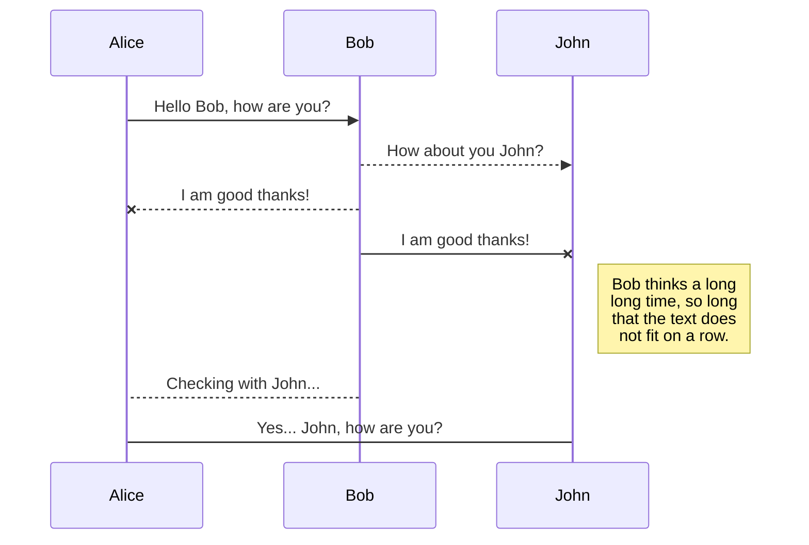
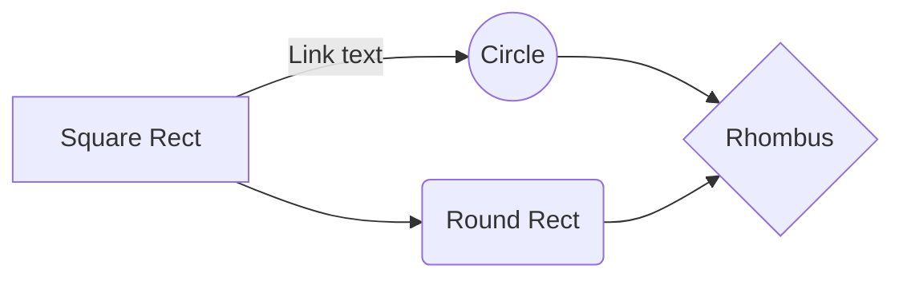

# **Chavas frescas**
![enter image description here](data:image/jpeg;base64,/9j/4AAQSkZJRgABAQAAAQABAAD/2wCEAAkGBxMTEhUSEhMVFhUXGBsXGBgYFxUYFhUXGhgWGBUXGBkYHyggGRooGxgYITIhJSkrLi4uGB8zODMtNyguLisBCgoKDg0OGhAQGy8lICUtLS0tLS0tLS8tLS8tLS0tLS0tLS0tLS0tLS0tLS0tLS0tLS0tLS0tLS0tLS0tLS0tLf/AABEIAQMAwgMBIgACEQEDEQH/xAAbAAACAwEBAQAAAAAAAAAAAAAABQMEBgIBB//EAEQQAAIBAgQDBQUGAggFBQEAAAECEQADBBIhMQVBUQYiYXGREzKBobEUI0JSwdFU8BUWU2JygqLhQ5Ky0vEkRGPC0wf/xAAZAQADAQEBAAAAAAAAAAAAAAAAAgMBBAX/xAAsEQACAgICAQMCBQUBAAAAAAAAAQIRAyESMUEEIlEjoRMUcYHhM0JhkfAy/9oADAMBAAIRAxEAPwD4bRRRQAUUUUAFFFFABRRRQAUUUUAFFFFABRRRQAUUUUAFFFFABRRRQAUUUUAFFFFABRRRQAUVbwfDbt3N7NC2RczajRZAnU9TXNvAXGmEOm+wiNDv50BRWopiOB4jLnFsleoKkfI1COG3fyGtUW/BrVdlSir1nhF9yQtskiJGkidtK6fgt8CTb01O68hmOk9KOL+DBfRV9ODXzoLZ2DcvdMQZJ8R61HiuG3bbZHSG00kHcSNjQ4tdoCpRVn7Bc/KflXv9H3PyH5VlAVaKtf0fc/IflUJstJWNRyoAjoqYYZ+n0roYK5+U/KgCvRVocOu/kPqK6/oy7+Q+o/egCnRVz+i735D6j965PD7g/AflQBVoq0OH3fyH5V3/AEVe/Ifl+9BtMpUVeXg987Wz8v3rr+hb/wDZn1H70BTF9FXX4VeG9s/L96F4VeOyH1H70GFKirn9GXfyH1H70VtMDQ9jVk3hvnw99I6lVtuKsYfEgs1p3bKTAEKVCkAznDkiPCdt+VRdj8JiMn2jDLna3dK5JA0a0QT3jBG2kTWjvcfvgD7RwvPyJyB59EI2quNUrJudS0LzhrhxSzny5tIRgIiNSNBJ0idfCRUvFMGlslAllQYbvyCpJCkAhgeamCNMw3nSWz2twIOV8E1uOSdyOmgcEelXE7Q8NuEk27q8yRnO2gnumNPGr+2Urv8A7/Y6yxUOLXkq2cAQnuISQdclpkAObKoE5pOWdvnrVlrLBVCBQveEZdzLAaGT7o+Mzz154nxbBexf7Ldue1jug+zaZO5zCYUE0nwf29EF1QzowB03AiRoIMa7CR4VRvdMSM12mxxY4ewYtoPzORMbHU6E6x1+GtZztXZIvtOphdQCBtpv5U+wXE7V9gHunDvljvsYMaTmyQpzA6tGoHOkvHUAvFcwbIqIWBzZ2CLnaefeJ1qHqK4qhoycmVLGoBqTJUOD0OXrqKvhKjF2jWV8lZ863XPia1OSspYPeY+J+tZMEW0q3YE1WspJpqlsKs1IokRxEAnerSYFyQFg+RrnBYcznO+48OlOhm1JBInlz84kVSCVNseMHKSihQcKwMNuORb9KlXDx+ET5imOIIIACnNJEZmOsSQFjLMQSB0151yRMaKdFHuqCe7AGwmZH8xVOEV4+4lrxZTt2mmAo15zp6xXIfqPn/tTG4bZ91R1lVGmoHOI3313+NUso+HWFjr+bWnhCDXuVfuTnKSen9i1hgTusfr47Va9hXWBsgT3pM66RlgRG5nQAz41Yy1zTrk0jrxJuKbKFzCCqN7h5GqmKctXBWlCUTNnCXfCitDkopuTJcEL/wD+Z8Vs2rF1blxUJuSMxiRlA32rVYjjNgo3s76BoMNmSFMaHvMJFfJ8BhmUHMI1HQ/ztVs28qiQczCVExC6d8ga+XryE1WVxVHJLFbs0/EsdhbUrpdvLp3g5AJIzSRIOoEySe741lOI3Wu6ygI/IioAOmgBI85rvDvqNTO/LXXTeZk1Y9oAdlYzGoBB5aiOZpVdDqNFHBWyLjW/xZvZz4lsv6V9vsWUtWgv4EX5KNfpXx645e4ot2wbjNoE0LNMk+e5mtzg+0RRFsYlChBAMsCSAQcoaYadBrB1O9XhFuJOUuL2NcX2dS9b76jO2rHmG30Ya6GR5V864twC7axfsLbiDljOe73hqSQNAOsV9dwOMt3B3GBjcbEeYOorE9s7SnEt1yr/ANNTyt1stjSfRj71tkIkjN4EGCDlYaeI32IgiQaZ4chgDXWJwqtZ9mYOpIOsgmJ1+A9KWcPutacpckodm6efh41OL2NKLGd8QrHoD9KyGASa0vaLEZLJAOraDy50l4dZ7vnRNhBWX+HWJ15Ux9jJ8K8wdmFir1m1UrOhROrdvTTpU3tGaAJ0UDQtrA/nQVNbt6T4Uw7M4vCZGt4myGuZpRybuUoQM6EWzMwDGmsx5uoScXKKuho54Yn7vJ5b4s1xSjBFdlyG7kBIGh0gQGInWeXlCi6WLKWbMMwAJiIUkACdPUb+NMuKYy17b7m0bVosMgLMDEFSzSSVkmfKvOJcUYm3aKWlYFWZraxJggAZRKgyWIG5M00YSil7VvZCeWE5NqxVaMe8JEA76mGAgSdDofHpFMOIYgNGRFQjvQCMkMCQCrgZohobfeeVUMNcIPd1Mabkasmm3XrpTG5i1Oj21UrtkAA1zHl/dkc9ABpVpJrJfwR1KPVEfDz7x8R/0ip2aATUeCuErBMge7toIBI08Sd6MZ7h8q5s7+ozv9OvpI8Q6V3I3PpVcPtXty6AJNImbIk9p/dHpRVb7Q3X5f70UWJQleww1S2Xb8IysVUzOZo38F589BBgXA4hyc1i4x5mSCeeuYH61v8As5j7dpHDmCWBAAJJ0imTcWtTnDHaGUgyRuCOUgzz5nwrox44tW5HBmlkUmox0fLMbbe2CHsm3Mb7nccj/M+Br2xwm84zW1VxlzE6qFMe6S0AsARoJ8Na0Hbt7mJKLZQlVJMyo8ANTOup9PGs4/CsSQ4ysF/CmeV1bkNhprWVGL0x+WSaTkvsPOx/D3LtdtwQqhZCORr72UllMxzGupitvdtB7eV7Nt0jQIw1+DhR/qr57w5MWly3rcCBSpHtDlllaSRO4Zv9NQ27vEQAA10HMWJ9sdSQuhExy+ZrpjmjFUc8vTzk7ZqbvCSjA4ZyCNRZfMjiOdsnUDxEiqmOvNdYm4GDwAQwAOg5xv586TXHxrG4WDkXJJU3JVWzB5tgmFgiBEaUwwFq5kBu5s+s5jmO+msmo5sqkqR0emxSjLZXuYc8qq3bcb6fSngszXFzC1ytndwsxHG1JKAHTYDpPTwppgMNt4Va4pw38Q5Gau8Ps6ChysSGKmd2bFW7duplt16iUpXicnaliLlgkjvBhAYSBqsnl4j4U1YaGqXs2ChVDDUk6rE6QfQAcvjNdfp5tRaXn5/c4vUQuSbRLc72bKZmDuDJKkQDkOndOmnWTpXOKuTcUEFdgZDE6FWgBV3joQdRXSqQ0i2SdIzR0YQROuhHTUTHKvHwzs5ZrcCRMRp7vU6aKfU09Lj/ACIpSv8Agt3Qn2eZli52DZ8sMR72gTQHQ5piSRS+4pzxc0JgmfiY93nEcvjV7HWwfdttGWAIXQwwGxECSOXWq98u7ZimbSNdNttjrWQ03v7jyXJaX66Gt/AIqI1q4bgcZzooyk6ZdNoAGh2pZfzwRAPxirnBLDKjBhEmeXQVNftiuTJGpvd/5O7C7grVGaXEEHKwgj5+IrlsRmcDpt51P2gsZkJG66z0pXwMk94+XxnU0tGSHgsN1PrRXs0U1CUd220Bq0jaUuS73Y8au2nlZrE9lEiWvWFRh689pTJhxJhRUaGvHugA0CskroLUFtqtKNqwyJyLdeFanUUFaVlhdiLUiqvDhpHTT0prdSl+DWHYeM+tYDGCJXRt1KiaVT4rxD2SjIodmYKATAGhMk/CmSsnKVIkZaqXL8aUsxvEBnUtiiUIBK21gCZUgkRqBrueRruw5dgiyzTk1iSwMa8pmnnjcVZKGZTbRcOLyFTyMGtHetgglSpDJnXKVIlSCfdP5S3IeVZ/jHC71qzmNstsDlhive5ideQ0mqGId8ORaJYM3fILKYB0A7siDB0mhqSV0JLJBvTNGdRXAt1Xwl095SScpIBIKlgOcHUaEH41ZF0Deps6Yy0ToNK4uroSTAGtUsdxBgVFuNScxPKBIjl1q3hrjZAWhlbZhPjvI8Dr4EUaEebdC7j+Hi0/kR+9ZfgtyAB4n61rLo0a3+E7fqPh9PKsY1o2bpU7E6fpTME2+zTre8vQUUsGLopLY3ELV0namuEbuVQjYCub3ERbAFajYvRau4+2jZHdVO8Ex9asoQdRqOo2rC4i4126zxuY12HIAk6Dl8alsX3syV05Su0mCJ010XSfGOdU/D0R/Mb6NveuZVJpO99oBG5MeU13x7FwAvM70rwbAkZjA+XxpVso5UmxxdxVxcl0KHBBGRJzLrAzCDI0Ox5jWmeAxxKq11cofLlPJi4ECBJG43/Sl17EKltIAkJOxBZQe4OUxtOsjrU2GQMgR8QxWybbooC5DGUhZyBjEwQYA0gkRVXBJHDH1ErHziKhTEISRnWRuJE1WPEVeQDqQRVTCYhVLl/aAHodI11geAH8zSKNnbPLxQ2cUviLvmPp/wCagtY9QwKNmQlQSY2YsAZH+U8+dScQuhWXrMfKllGmNjyKZJxnGNbtyvlWSxeMe5oT4+lariKB7cGT4Df6H6Vnr2DtggQzE6TmAA21gLrv15GmivJPLNLXyVcPwy46E5bkQfdQkwBJ3KjbXQk+FW3xNwXPbTDlg57iJDqRrkUlRMA+sjXXjCcZIyo6nKPeOrsJC+4gZEIlVOV83PXUivOL2ggW5aRFw7hcpQswzQvtEcsxYOrHYxIggQavLjxOSN2b/hmKu/YrtzFZpyuRmUKxUqABlUDdiQNJ1HhWI41dVr6ui3BNsEm4+d3YE6sczawAN+Ww2ppa7SXcSAj28qI2WQRlZlUEFiSCTOsAHcDczS7H2Ge4pRe4um4175zEEmTuBG+hgUknaoitOxzh7veWGLQi5ieR1SNhIhVM66jWqvF8WQ2m1WsBdtIQj3URyBbKsyhiZ2jcalhUfaLh5CZxy38Kg0ejheqF2HxDNMHUAn0GseMTT5MexW0oVVtsgIjXQEgk66NmBnc/pnOCGXCjUtoPjTu4ps+ysKZZAEuEbZ7hkoD0EKPWpuXuUQzKMWpPuxobA3rPdqLCtlA940wtcV+7cxLICTJCxBA5mZk7b/pULLeYukkAkLmgFtjtyIkA/wC9Wp0Ks0OVJmTNm6NJ+le1ofsB5qflXtFDczq6IPwrJ8QxOZyaf4zHBrWccx8+lZW5rMeJ9BJ+QrIrYsp+3Ra4YXkqFLRmmFZiuYQT3QYGg9Ks4FFe7bTvAHWIGpBLfHSdfCpcHi7ClCuZGBBLZNO7qFlHzROucCdBoYprgL5uXc73Vu+zScwGrFgwBJIDTAg5hOvKau6ULOaO5ULeM3s10+FcWnyoT1ER5nU/KpLWFN640bCST6wKEw4KE5TIkTOggSZEa79R8eUoHTl/pyJhdvW2R82uWFIbLkEAxMCDr8akwOLb72dsu0AEEkDkOgiprTXUtMLi3DJUEEGCujKCSPAED4+NVEaVdySWMA6ACQSdI+Hzp8mkcfp4pzR5hbhDSN9h5nQVoLdy6A7Kyw2wLgymW8wGWJ/C2x0kVn8GDBggHx/T6/CtDbbD+yDvbddVEiSZ1PpodR4+NSekd0tsn4m1xu5eRVYq5lQ2olO8rHQgyfHu0g4xjT92/Pn5wQ3zmtLYCsrstxREmXiS5tXlQK7MAoJbxkhdtSMz2wXupdVEW2YC5BoWAHtCSDBbPm1G+/iX43FM51PhkaJ+G44l9WgRvExqAdPImosfctgrkZmIZpnQbyI+tL+H3dvKrtuyht3GZwriCoP4tGlQOZmNRtFNHqiWeH1Y5LK2CCe3CMmdi4RVM5SS2VcxDA9Bzq3xzibtaCW7dq3avIYVUVVLKdeQ7w0IY694bailfE7bKVuqYLd4Ho4gz9DTXHXBiLeJu2kJS3dF92aENtLxNtray5Ly2QTAj2e2tVhK1Q0407OeHC6MMXULlZgG1kggFTBUx/4rYcPwIFu37xGXu5pIAOpCySAPKknD3YYd1YzDIWMlu8uXPM94EEEEHnMd3LT/AIfiAO4B3Rt1joSN4qLpMtCC42hJ/VPEvbLEvJe+lxzctjOlzK9mSFZ2PtFLNm1IEAruNLcw+ZSjakjXpMa00XFysKsedVUTellJeB8ceNs+ZrcbDXyDoUMg+H4TVrEcQa7ca4plWKh0M5AYIAIHI96DuJPPWr/bzh3u3VGo7p8RqR+vrWQ4ZxO7YfPaaDGoIBVgNYYHf61Nw/uXZSTi17lZs8Clu+Yd2UsjBXmC7KMyC51cEBSeYYNuJK0Ygi5ma7Ptc11lRlUZyzgi4hhVM666Q4IO9NWxVu7h1vIi2wz/AHyIBGZBpct81OVyYBjrMUr4rh9PaEqpGZXnm6cgerAhh1JYCq4584njT+nkcV+wwWyxEiIOo8jXlR2MUgVQGUAAAAgSBGx+/GvwHkKKXgdX5tlE9mMY+FQpahQjOwJAdjnYiF3PcCHXrWYsp3GcMhlYjOqsBKlu68EmBHdDbmvrXZ7tPaW1F4hFECRJVGOqgR/w2HeQ7AZl0yifnPbVbJxVx8OrqpPeVlC5bknPlEzBOuvMnwq0opPRkJ3pij2Y5kgEiBAJymSDuATt0+FNcFeCo5UZZhQJk6CSSepkdBXOMsol22guqylVzPlJHuRJCtJXUjSDA57mfH4VQ1sWx3bgzABmYAMZGrAE92NxU3tHRi7H3Z3CxaJjVtT8f9qnx/CiGNy1IncAxryM1dwNqFAprg3Ue8D9aW0dLTW0ZnCY69agNqDIKi3DqIjU5crA9NduWlccXtk2XuFQGZ10Agak8uRJNa3E3LR2GtI+KwcicjcHylh9KH+pijFu1Givwzhvs1BbWYJ689B4fuKZFyoVQwKGAIKkjVY1MTqR/Jrtzl73l8h+n61Usm2zjOYEnXJJAGcgwI1lbfrQ0LJbLeAxio6M6sQVyiELb9Qp1nb0rK8fRb1u61tILMboX8QUNljoYWNB1FabFgC0QkSGEGSgjugajUbUgZCGSBb7rhiEF0sCQTM3fwkW4MH4VSPVHDlVTRmeCoXYW1JBPTc8oHjrTnEr7KUyBmX3p2HP8Jil/FsJ9nxF0Ad3Rh4Kx/eR8Kgt4nOMqkLM5mJOoOsHlGlYGaUlSNE+H+0Yc5QAwggDado1qpwLs5edyGsAgiA7Zfu23VgCcriQAVIIKkjxq9wKVCaQGTTU8ievmK1eFTxpVOmdax8oo5fhoCspglpzFZyyVywCdSAAAJJMAUt4NckCdxofMaH51r7ODDIW6cqyFi1kv3E6NI8m1+s0s3eykKSpGjsnSpkB5VBYTSmOFcDSAaVA2J+K4L2iFTXym7ZOHxGS4h1JUabgmAyz/Otfaby1lu13B/b2+7o695T4xsfCtToxqzKG1cW+vsgfYWswCspEqy65yJGZwFUmeYGgE03W0GUpOjBUBOmsE4W4ekibTfl1mp8CwuorHRgsHQAjqD4gzVqxgE5gnSNSSIJzRB3GbXzp1JI4s/pJzlaMuuDciQhg+FFfQBeP5m9T+9FZZn5F/JgMDj1cJnA+9DKy6BW1GaDsqM0spMZLikjukx7xLhxcZd7iLIMQb1kSA0bi4kFWXeFPNTKa3dEMXT3tF5ZMugHlECPCtZwm9ca0jOAXRpRiSHXuwGEbnQTMg5UkTM2clWxOLctGOwOBzMUglm0WNhqJc+Sz8SK0mOUHFogAhLS6dI0/anNnDAe4mu5yjc9dPGlfCsBdfEXbrW7gE5RKMJAjUSNtKi3fR3448e+zUYNNBTZLKR/M/wAzSrCqfyn0MVfN1NAtxT4AjnWJMeUl8kN23GmlI8cPv7Y8GP8A0gfU07vPBgkSdhOp+G9J7qMcR7rQqgbHckk/KKWmMpIvDD5iCCARtO3KQfSu0wfs4zW7bgLl3I/KJ0jWBtV7BW1nWCRqVPqJEgwarOVM95fUaU26FkouVlO5hvaL7PUZjyMEeR+FdJwJLXd75POSAIJBggb6gHWp8I6lwQQR4EH6U6xYBM/z50J6EnCLkrRkOO8KW6ylvxKVkec/vSvCdjLE943W/wAwH0E1r8cmgPRh89P1rqzbpVJlHCL7FHFMOttbIRYVTl6kAiN/MCmWC2o47h81luo7w8xqPpVfhV+VBHSh9mqqNJw+7E+Iis32js5LqXhse43rKn1kfGm9p6Mbhlu22RtiIpmrVCR07IMLdlRVq21IuEXiCbb+8hg+PRviP1p2jVkTXotJUV+yIr1Hrp3raMsy93Di3dIGzd4fr89fjVq2tS8ZsEqGXddfPqP58KrYXEqyzSeR+WibSiova0VpnIx9/hj22DJJtzqIn4EU8wWqAxFeriNKkS5Wt6olGFSs0PZK4od1MSQCBpJAmY9RT77QW1VSR1kCf8PXz0FfOsRjLSMC7sje6rqWBXNBbbQmFA1gSZkRW0TG3bI+9UPbAEXLYgxsJT029K7PS6VnD6tXMi4lxEWLbE6BQW13VRuI1noCJHpr8Ye88lxIa45ylWIg/iUHp94voK+nce4193M9+4wKABSEW2Q7u2bu5FGUSfxTFZDGcfAZfbW1Ygys27GUGR3hlyxsNfKqZWn5JYvb4Ew4hcstdKXCGD5Mwmd28OYSmmK7U4oXGFu40tbtkAAGJS3cLQVM6Fv+aqvFeMYa4QBh0Qk5nZc0M0NEAN/eJmTvUmF4phAy3G9/J7P/AIgIQJ7MCUmO5pO/xqab8Mq6+Dtu115srM8wuXZRDZSBcVgMytsxAIHwNSYXiovn78kO2iXlUZkO0OFAzr8/04xOL4cbWRLKqwkr99dIJOXMGDCY7o0B9K8xHDDeve2thUzsrhNWUEwfekQCZOkxNbcwqBqeB4VLKhLZDLJIYQc2gBYEbgnWtEbulIsBhlRmReTGYmCdATr1inArgWz1ZpRdFXiVwi2x6CfTWvcFi8wBFR8bb7i5Ak5DHnFIOzPFQQLbGGG394eHj4UyiI5ro19xpFIOGHJce0fwmR/hOo9NR6U6tXaVcWt5XW8NMvveK861oxSHNpqto1KsPdBAIMgiQeoO1WVu0yFsocdw5RhiEGo0cfmX9xvVrCYoMoIMgiame4CNaQT9nuRP3bHT+6Ty8qzphdmgN2uTfqsLulRu9aYWbl6kPEbZtn2if5l6+I8frV5rlUseWKkIJaDA/esqzW6RGvF7JAOdP+YUVk/6uYj+z+dFNwJfiGgtNVg3comqllqrYrFSwT+YpGiqZVx6M7KAJZmhf0HxJFfUMfixbtrbOoQLO2raZQZ6DvRr8qzfZnDrma60RaXNm/Lo0kDmYBiRAMHlBXW+JvcUsy90szKxMmdiqjciSxZjMsSB7tWhLhjs5PUR5SPeIYBHJYs6lhGjDVZmArAiJ36nek+I7Ko5lb7ZmP4gpkyJJ1HMifOmbXVAm5mURJ0WQTqN5Gv671HeuG57FTAIGYKNSc0kkR5LSJtnNxlG3YtPZlQt2Idg0ITnRQo0ExI1A8arYnsu6+xCobnO6wIA1I7sZp0E6jrX0bsdxmzbseybNmNwvsYZSFA7xEbLtNJOKY4+1QLILOVYEbazpI2jp0qnaNc5xaa2Y3EcNdLQVrTQZY91pVgWADddlO+x582GB4K1u1bvG4e9lIUE6AiZPTyFfQ8DZUsIYeXUkx61b4vwdldGSGyhWynrow1nTel4txfHs6fT5ovLFz68me4XtPXemmal2NxHs7oRrNxSUBJCZgSSwnuDXYax/u64fw17gB91epBB+AOvrUoRfR25sqlJyLHA7GZyxGij5n/aaq8b7EWbzZ7ZNp95XYnrHWtNhsOqKFXb5k9TUtXUdbOSUrdmNwnZbFKQDiEZfFDmj4MKg7YdnLxtg2mLAe8mgzePj5VuqCKOCM5s+O8F4x7P7u5OUaA818D4fT6acXZEim/aDsjZxEsO4/5hz8xzpDheyOLtHKl1CnQgkenL4GkcWiimic3KocWuqLbFxI6DmeVafA9n4g3WDeCggfUmmdzBWyuXKI6RWqDB5F4PkPDu0L2+64zr6Mvl1HgfWtFgeKW7uiEz0KkH12+daPFdlsOxkovpVrB8KtWhCKB8K3gL+IJbHCbjmTCL1OpPkP3pthsAlsQo1O5OpPnV1q4amUUhJSbIcg6UV1FFOIfLMTjVtLmY+Q5nypPw7Fl7hZtz8h0rS9qeFe0sgoNU1HiOdYe0xUzzFQcS6ns3Nzigt2LttmCLeUIXgmIMxA1MidulLcBilW39zmcsTqy5csSBIDHTyJmTtSziF32tkEfhdVbquaYnw7hrvhWNC2zy74VdogrIU8/wn4tSNOjcq5qkM2F1gwzZQwghR3Sp3medV7SJmOb8KnuhjDMCiqIOhMyfIGrxxEWRcMMxLSqiciCQrMZkExt0qiMK1w5rYzAKGJGvwPjqaRZNEIwkpe5FzFcbvKyOCci21RVYAqFH4AI0HhPyrzDY1718PdHu7KugBMxHgJPOociOVGYQN1Oh0899fpTKygHWOhJj1OvzqnOyUnqjQ8NxQBlj5fHf+fGtlbv5wHPMD5AKPkK+XYPEoCAGL67AiQummYwBtsT1recGx0oisCpKiJiDpMCDofAwdD0rp9O9sjKNKh5aQdBUwqG0dKlBrZ9s6sf/AJR0K8doBPQT6UTUeIPcb/CfoaUYQ2e2KMhcYfE5RoZWyIMAxrc8amtdqrbGPZ3RpP8AwjG2+Vz/ACKxGAxI9rct3XfIHkCXOZSsZSAd1hfHQ1dGOse1VEkMZBLAiRBgEtqdYpbYGtudprQ/Bc9F/wC6qr9sbA3S76J/3UkxS6Vl8XxAe19lBnMBNLyZtH1b7e3Oy483w/8A+tefbR0j/Pa/R6p4V+8wG0HTvfpv8dKh9nM+H886sqOR5pXSGFzG2wJLqP8AMD9CarXeL4dQSby6CTC3Dp8FpdeaLT6E6jTv5d+eUZfKayXHGjNosQdoNbxQY8s5UfRVaQD1E+tcGvLB7i/4R9BQaQ6TmivJr2gDMqJpJxPsslw5l7p8KmTtHhf7Zf8AV+1Tr2mwn9uv+r9qx0zRNb7L3VS5bVgVuZc0jXuEspBB01NWuF9igIFx2IBDQNBIiPpTNe1GD/t09G/ap07V4P8AiE9G/aspG2y5Z7P2BbFqDlAIBnva797eusH2ZsWyxXPLb6ggwIGkQfjVZe1uC/iE9G/apV7X4L+IT0b9qxxg1TNU5J2mRY/sXave8x6A5UBAkmBCiNztRgOwOHQznuHzKn6gxVpe2OB/iU9G/au17Z4H+JT0f9qFGKVIxtvssr2Uw/8A8n/MP2pucAhXKQYiN9RG0HkdB6UjHbXAfxKej/tXa9tsB/FJ6P8AtTKo9CcF8GjtrAiZ8TuakBrN/wBd+H/xSej/ALV7/Xfh/wDFJ6P+1FjJUaSa4xB7reR+lZ7+vHD/AOKT0f8Aahu2/D/4pPR/+2i0ae4NPYg3LeRbhgFiqljoAO8wnppPSu8Vinu6uxJ6E7eEcqWf1uwGn/qLYjwbTfbTppUdztTw8gD7SgI0BGaR8vkakad4qzWTTDg4p5GzKfmtOeIdpMMbbZcTbzDYiZOonQgwYms7jeK2bbi4mIS6W1MB8wiNGEAD4VtBej6Xh4zdd+QPI/3W+lVnvGNI/kUi4T2vwrqHuX0tkGCjZiY66IwjXmOVdPx3Bn/3tr0un/6iuiLj5ObHFrtFrEXsyXJI0yxIB/NtoSNvDxrI8eu5bVw+H10rQJxnAhWBxtozH4LnKfDxrKdssbhjay2L4uliJAVhlAg6k761spKnRqi+dn1nDnuL/hH0FesaQWe2GBCqPtKaADZunlXrdsMD/Ep6N+1StFh3NFIv634H+JT0b9qKLMPiFFFFSHCiiigAooooAKKKKACiiigAooooAKKKKACiiigAooooAKKKKACiiigAooooAKKKKACiiigAooooAKKKKACiiigAooooAKKKKACiiigAooooAKKKKACiiigAooooAKKKKACiiigAooooAKKKKACiiigAooooAKKKKACiiigAooooAKKKKACiiigAooooAKKKKACiiigAooooA//Z)
   
En este repositorio nuestro equipo las " Chavas frescas" desglosaremos como logramos crear un robot para participar en la World Robot Olympiad en la categoria de Future Engineers. 

# Contenido del repositorio

* `models` — contiene los modelos 3D de nuestro robot.
* `schemes` — contiene el esquema de conexiones del robot y un diagrama de flujo del codigo.
* `src` — contiene el codigo de nuestro robot.
* `t-photos` — continene fotos de los integrantes del equipo.
* `v-photos` — contiene seis fotos del carrito.
* `research` — una seccion dedicada a temas que investigamos en el proceso de crear el robot.
* `video` — contiene un archivo markdown con los links de los videos demostrativos de nuestro robot.
* `other` — contiene archivos que ayudan a entender más a fondo como preparar el robot para la competencia, contiene datasheets y imagenes de los componentes.  

# Tabla de contenidos

blah blah indice **offline!**

# Equipo

//foto de todos juntos
//descripcion y foto individual de cada uno 

# ¿En que consiste la competencia? 

La World Robot Olympiad es una competencia mundial de robótica que busca una competencia sana para jóvenes, alentando el aprendizaje y la curiosidad.
En nuestro caso participamos en la categoría de Future Engineers, en la cual existen dos pruebas, la prueba abierta y la prueba de obstáculos. En la prueba abierta nuestro vehículo debe completar exitosamente tres vueltas a la pista. En la prueba de obstáculos además de dar tres vueltas a la pista el robot debe de ir esquivando obstáculos y al final estacionarse en paralelo. En ambas pruebas existen elementos aleatorios como la posición de los obstáculos y el sentido de las vueltas, además de limitaciones para el robot.

# Fotos del robot

//foto de la derecha
//foto de la izquierda
//foto de arriba
//foto de abajo
//foto de enfrente
//foto de atras

# Videos del robot

//video de la prueba abierta
//video de la prueba de obstaculos

Los vídeos de rendimiento deben demostrar el rendimiento del vehículo de principio a fin para cada desafío. Los vídeos pueden incluir comentarios, títulos o animaciones. El vídeo también puede incluir aspectos de las secciones 1(gestion de movilidad), 2(gestion de la potencia y los sentidos) o 3(gestion de obstaculos)

# Hardware

**Esp32-WROVER**

**Raspberry Pi 4 Model B**

**Servomotor MG995 180°**

**Motor JGB37-520 DC 12v 178rpm con encoder**

**Motor driver TB6612FNG**

**Cámara OV5647**

**Sensor Ultrasónico HC-SR04**

**IMU MPU6050 6 Grados de libertad**

**Baterías 18650 3.7v 3000 mAh**

**BMS FTVOGUE 3S 12V**

**LM2596 Regulador Step Down 25W 3A**

## Reporte de costos
|Nombre| Cantidad | Costo por unidad | Costo total |
|--|--| -- | -- |
| Esp32-WROVER |  |  | |
| Raspberry Pi 4 Model B |  |  | |
| Servomotor MG995 180° |  |  | |
| Motor JGB37-520 DC 12v 178rpm con encoder |  |  | |
| Motor driver TB6612FNG |  |  | |
| Cámara OV5647 |  |  | |
| Sensor Ultrasónico HC-SR04 |  |  | |
| IMU MPU6050 6 Grados de libertad |  |  | |
| Batería 18650 3.7v 3000 mAh |  |  | |
| BMS FTVOGUE 3S 12V |  |  | |
| LM2596 Regulador Step Down 25W 3A |  |  | |
otras cosas ...

# Mobility Management

blah blah 

# Power and Sense Management

blah blah

# Software

blah blah

# Obstacle Management

blah blah

# Robot Construction Guide

blah blah

# Our journey

blah blah

.... 
cosas de la plantilla 

Publishing in StackEdit makes it simple for you to publish online your files. Once you're happy with a file, you can publish it to different hosting platforms like **Blogger**, **Dropbox**, **Gist**, **GitHub**, **Google Drive**, **WordPress** and **Zendesk**. With [Handlebars templates](http://handlebarsjs.com/), you have full control over what you export.

> Before starting to publish, you must link an account in the **Publish** sub-menu.

## Publish a File

You can publish your file by opening the **Publish** sub-menu and by clicking **Publish to**. For some locations, you can choose between the following formats:

- Markdown: publish the Markdown text on a website that can interpret it (**GitHub** for instance),
- HTML: publish the file converted to HTML via a Handlebars template (on a blog for example).

## Update a publication

After publishing, StackEdit keeps your file linked to that publication which makes it easy for you to re-publish it. Once you have modified your file and you want to update your publication, click on the **Publish now** button in the navigation bar.

> **Note:** The **Publish now** button is disabled if your file has not been published yet.

## Manage file publication

Since one file can be published to multiple locations, you can list and manage publish locations by clicking **File publication** in the **Publish** sub-menu. This allows you to list and remove publication locations that are linked to your file.

# Markdown extensions

StackEdit extends the standard Markdown syntax by adding extra **Markdown extensions**, providing you with some nice features.

> **ProTip:** You can disable any **Markdown extension** in the **File properties** dialog.

## SmartyPants

SmartyPants converts ASCII punctuation characters into "smart" typographic punctuation HTML entities. For example:

|                |ASCII                          |HTML                         |
|----------------|-------------------------------|-----------------------------|
|Single backticks|`'Isn't this fun?'`            |'Isn't this fun?'            |
|Quotes          |`"Isn't this fun?"`            |"Isn't this fun?"            |
|Dashes          |`-- is en-dash, --- is em-dash`|-- is en-dash, --- is em-dash|

## KaTeX

You can render LaTeX mathematical expressions using [KaTeX](https://khan.github.io/KaTeX/):

The *Gamma function* satisfying $\Gamma(n) = (n-1)!\quad\forall n\in\mathbb N$ is via the Euler integral

$$
\Gamma(z) = \int_0^\infty t^{z-1}e^{-t}dt\,.
$$

> You can find more information about **LaTeX** mathematical expressions [here](http://meta.math.stackexchange.com/questions/5020/mathjax-basic-tutorial-and-quick-reference).

## UML diagrams

You can render UML diagrams using [Mermaid](https://mermaidjs.github.io/). For example, this will produce a sequence diagram:

And this will produce a flow chart:

