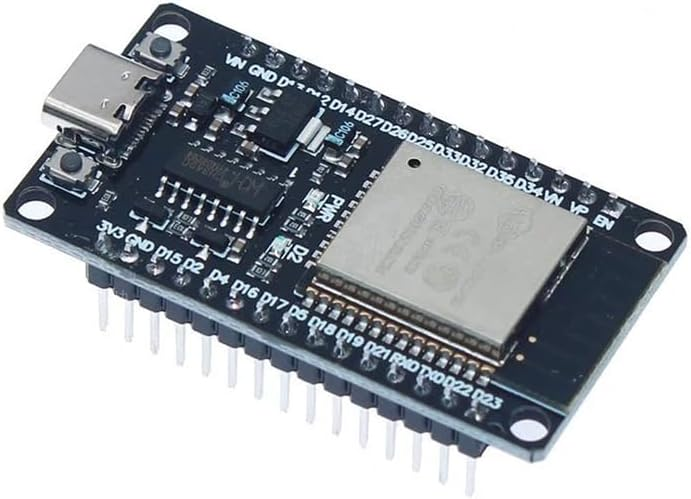
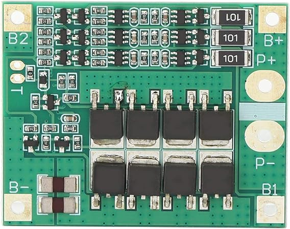

# **Chavas frescas**

 

 

   

En este repositorio nuestro equipo las " Chavas frescas" desglosaremos como logramos crear un robot para participar en la World Robot Olympiad en la categoria de Future Engineers.

# Tabla de contenidos
* **[Contenido del repositorio](#contenido-del-repositorio)**
* **[¿En que consiste la competencia?](#en-que-consiste-la-competencia)**
* **[Equipo](#equipo)**
* **[Fotos del robot](#fotos-del-robot)**
* **[Videos del robot](#videos-del-robot)**
* **[Hardware](#hardware)**
  * [Reporte de costos](#reporte-de-costos)
  * [Mobility Management](#mobility-management)
    * [Chassis](#chassis) //
    * [Design](#design) //
    * [Motors](#motors) // ?
  * [Power and Sense Management](#power-and-sense-management)
    * [Power and Wiring](#power-and-wiring) //
    * [Sensors](#sensors) //
    * [Schematic](#schematic) //
* **[Software](#software)**
  * [Initialization and Connection Process](#-initialization-and-connection-process-) //
  * [Object Management](#object-management)
    *  [Object Detection](#object-detection--open-challenge--obstacle-challenge-) //
    *  [Wall Detection/Management](#wall-detectionmanagement--open-challenge--obstacle-challenge-) //
    *  [Signal Pillar Detection/Management](#signal-pillar-detectionmanagement--obstacle-challenge-) //
    *  [Turning (Open Challenge)](#turning--open-challenge-) //
    *  [Turning (Obstacle Challenge)](#turning--obstacle-challenge-) //
    *  [Parking Lot Detection/Management](#parking-lot-detectionmanagement--obstacle-challenge-) //
    *  [Three-Point Turn](#three-point-turn--obstacle-challenge-) //
    *  [Backing Up](#backing-up--obstacle-challenge-) //
* **[Robot Construction Guide](#robot-construction-guide)**
* **[Nuestro proceso y reflexiones](#our-journey)**

# Contenido del repositorio
  
*  [`models`](models) — contiene los modelos 3D de nuestro robot.

*  [`schemes`](schemes) — contiene el esquema de conexiones del robot y un diagrama de flujo del codigo.

*  [`src`](src) — contiene el codigo de nuestro robot.

*  [`t-photos`](t-photos) — continene fotos de los integrantes del equipo.

*  [`v-photos`](v-photos) — contiene seis fotos del carrito.

*  [`research`](research) — una seccion dedicada a temas que investigamos en el proceso de crear el robot.

*  [`video`](video) — contiene un archivo markdown con los links de los videos demostrativos de nuestro robot.

*  [`other`](other) — contiene imagenes y archivos que ayudan a entender más a fondo como preparar el robot para la competencia, contiene datasheets y imagenes de los componentes.

# ¿En que consiste la competencia?

La World Robot Olympiad es una competencia mundial de robótica que busca una competencia sana para jóvenes, alentando el aprendizaje y la curiosidad.

En nuestro caso participamos en la categoría de Future Engineers, en la cual existen dos pruebas, la prueba abierta y la prueba de obstáculos. En la prueba abierta nuestro vehículo debe completar exitosamente tres vueltas a la pista. En la prueba de obstáculos además de dar tres vueltas a la pista el robot debe de ir esquivando obstáculos y al final estacionarse en paralelo. En ambas pruebas existen elementos aleatorios como la posición de los obstáculos y el sentido de las vueltas, además de limitaciones para el robot.

# Equipo

//foto de todos juntos

//descripcion y foto individual de cada uno
  

# Fotos del robot

//foto de la derecha

//foto de la izquierda

//foto de arriba

//foto de abajo

//foto de enfrente

//foto de atras

  

# Videos del robot

  

//video de la prueba abierta

//video de la prueba de obstaculos

  

Los vídeos de rendimiento deben demostrar el rendimiento del vehículo de principio a fin para cada desafío. Los vídeos pueden incluir comentarios, títulos o animaciones. El vídeo también puede incluir aspectos de las secciones 1(gestion de movilidad), 2(gestion de la potencia y los sentidos) o 3(gestion de obstaculos)

  

# Hardware

***Esp32-WROVER*** 

Es un Single Board Microcontroller (SBM), es un sistema en chip (SoC) económico y de bajo consumo que combina funciones Wi-Fi y Bluetooth. Desde una perspectiva técnica, el ESP32 es un MCU de 32 bits con un microprocesador Tensilica Xtensa LX6, con una velocidad de reloj de hasta 240 MHz, 448 KB de ROM y 520 KB de SRAM. También incluye una amplia selección de periféricos, como un ADC de 10 bits, 6x PWM, I₂C, SPI, UART y más. La programación del ESP32 es relativamente sencilla, ya que admite diversos lenguajes de programación, como C/C++, ensamblador y Python. También es compatible con el IDE de Arduino, una popular plataforma de código abierto para la programación de microcontroladores. Para ver mas información puede ver el [datasheet](other/Datasheets/esp32-wrover_datasheet_en.pdf) y la descripción de los [pines GPIO](other/Datasheets/ESP32_Pinout_V3.0.png).

Su función en nuestro proyecto es hacer de motor controller y obtener lecturas precisas de los sensores, dada a la rápida comunicación que tiene entre componentes. Elegimos al Esp32 sobre la opción clásica que sería algún arduino, ya que después de analizar ambos llegamos a la conclusión que el Esp32 es mejor. 
<table>
  <tr>
    <td width="400px" style="text-align: center;">
      
    </td>
    <td width="500px" style="text-align: left; vertical-align: center;">
      <h3>Especificaciones:</h3>
      <li>Voltaje: 2.3V ~ 3.6V</li>
      <li>Amperaje: 80mA ~ 250mA </li>
      <li>Peso: 6.8 gramos</li>
      <li>Dimensiones: 18 × 31.40 × 3.30mm</li>
      </li>
    </td>
  </tr>
</table>

 

***Raspberry Pi 4 Model B***

El Single-Board Computer (SBC), es un pequeño computador, consiste en una placa base que soporta distintos componentes de un ordenador, como un procesador ARM de hasta 1500 MHz, un chip gráfico y una memoria RAM de hasta 8 GB. Para ver más información consulte el [datasheet](other/Datasheets/raspberry-pi-4-product-brief.pdf).

Hace la función del cerebro principal del robot, esta a cargo de la computer vision interpretando los datos de la camara, ademas toma las decisiones importantes.

<table>
  <tr>
    <td width="400px" style="text-align: center;">
      
    </td>
    <td width="500px" style="text-align: left; vertical-align: center;">
      <h3>Especificaciones:</h3>
      <li>Voltaje: 5V</li>
      <li>Amperaje: 2500mA ~ 3000mA </li>
      <li>Peso: 46 gramos</li>
      <li>Dimensiones: 88 × 58 × 19.5 mm</li> 
      </li>
    </td>
  </tr>
</table>

 

***Servomotor MG995 180°***

Un servomotor es un tipo de motor que permite controlar con precisión la posición, velocidad y aceleración de su eje. A diferencia de un motor eléctrico convencional, un servomotor utiliza un sistema de retroalimentación (como un encoder) para monitorear y corregir continuamente su movimiento, logrando un control más exacto. 

Usamos este servomotor para controlar la dirección del carro, decidimos usar este modelo de servomotor devido a su gran torque. Para más información consulte el [datasheet](other/Datasheets/Servomotor_MG995_datasheet.pdf).

<table>
  <tr>
    <td width="400px" style="text-align: center;">
      
    </td>
    <td width="500px" style="text-align: left; vertical-align: center;">
      <h3>Especificaciones:</h3>
      <li>Voltaje:  4.8V - 7.2V</li>
      <li>Amperaje: 200mA ~ 1200mA </li>
      <li>Torque: 9.4kg/cm (4.8V) - 11kg/cm (6V)</li>
      <li>Peso: 66 gramos</li>
      <li>Dimensiones: 40 x 20 x 43 mm</li> 
      </li>
    </td>
  </tr>
</table>
  
 

***Motor JGB37-520 DC 12v con encoder***

Elegimos un motor de corriente continua, debido a su facilidad para usarlo. Estos motores toman la energía eléctrica mediante corriente continua y la convierten en rotación mecánica. Despues de calcular el [torque](/research/README.md) concluimos que ibamos a necesitar un motor con un buen torque para poder mover el robot. 

Este motor tambien cuenta con un encoder, el encoder nos ayuda a monitorear las el moviemiento del motor.

// gracias a el pudimos implementar un sistema [PID](/research/README.md) para corregir las variaciones de la 
// energia y contar un moviemiento consistente. 
 
 Si quieres saber un poco más del motor revisa esta [imagen](other/Datasheets/motor.webp).

<table>
  <tr>
    <td width="400px" style="text-align: center;">
      
    </td>
    <td width="500px" style="text-align: left; vertical-align: center;">
      <h3>Especificaciones:</h3>
      <li>Voltaje:  12V</li>
      <li>Amperaje: 120mA ~ 2300mA </li>
      <li>Torque: 6.5kg.cm (120mA) - 9kg.cm (2300mA)</li>
      <li>RPM: 178rpm</li>
      <li>Peso: 170 gramos</li>
      <li>Dimensiones: 63 x 37 x 33 mm</li> 
      </li>
    </td>
  </tr>
</table>
  
 

***Motor driver TB6612FNG***

Un motor driver nos ayuda a controlar el motor con un voltaje más alto, controlando la velocidad y el sentido de giro. 

El driver para motores TB6612FNG posee dos puentes H, puede controlar hasta dos motores de DC con una corriente costante de 1.2A (3.2A pico). Dos señales de entrada (IN1 y IN2) pueden ser usadas para controlar el motor en uno de cuatro modos posibles: CW(giro en sentido de las manecillas del reloj), CCW (en contra de las manecillas), short-brake y stop. Las dos salidas de motores (A y B) pueden ser controladas de manera separada, la velocidad de cada motor es controlada mediante una señal PWM con una frecuencia de hasta 100kHz. El pin STBY cuando es puesto en HIGH coloca al motor en modo de standby. El driver posee diodos internos de protección.
Elegimos este motor driver debido a su gran eficiencia energética, su tamaño compacto, genera menos calor y su control preciso. Para saber más sobre este componente revise su [datasheet](other/Datasheets/TB6612FNG.pdf).

<table>
  <tr>
    <td width="400px" style="text-align: center;">
      
    </td>
    <td width="500px" style="text-align: left; vertical-align: center;">
      <h3>Especificaciones:</h3>
      <li>Voltaje lógico (VCC): 2.7V - 5.5V</li>
      <li>Voltaje de motor (VM): 4.5V - 13.5V</li>
      <li>Corriente máxima por motor: 1.2A continuos / 3.2A pico</li>
      <li>Peso: 5 gramos</li>
      <li>Dimensiones: 20 x 15 mm</li> 
      </li>
    </td>
  </tr>
</table>
  
 

***Cámara OV5647***

Usamos una mini cámara gran angular, esta se conecta directamente al raspberry. Para conocer mas detalles de la cámara puede ver el [datasheet](other/Datasheets/ov5647_full.pdf).
  
<table>
  <tr>
    <td width="400px" style="text-align: center;">
      
    </td>
    <td width="500px" style="text-align: left; vertical-align: center;">
      <h3>Especificaciones:</h3>
      <li>Video: 1080p a 30fps</li>
      <li>Campo de visión: 2.0 x 1.33 m a 2 m</li>
      <li>Peso: 11g</li>
      <li>Dimensiones: 25 x 24 mm</li>
      </li>
    </td>
  </tr>
</table>
  
 

***Sensor Ultrasónico HC-SR04***

Los sensores de ultrasonidos o sensores ultrasónicos son detectores de proximidad que trabajan libres de roces mecánicos y que detectan objetos a distancias que van desde pocos centímetros hasta varios metros. El sensor emite una onda y mide el tiempo que la señal tarda en regresar. Más detalles en el [datasheet](other/Datasheets/HC-SR04-Ultrasonic.pdf).
En otras palabras el sensor ultrasónico nos permite saber con precision a que distancia se encuentran las paredes. 

<table>
  <tr>
    <td width="400px" style="text-align: center;">
      
    </td>
    <td width="500px" style="text-align: left; vertical-align: center;">
      <h3>Especificaciones:</h3>
      <li>Voltaje: 3.3V ~ 5V</li>
      <li>Amperaje: 15mA </li>
      <li>Rango: 2cm ~ 400cm </li>
      <li>Peso: 12 gramos</li>
      <li>Dimensiones: 45 x 20 x 15mm</li> 
      </li>
    </td>
  </tr>
</table>
  
 
  

***IMU MPU6050 6 Grados de libertad***

El MPU6050 es una unidad de medición inercial o IMU (Inertial Measurment Units) de 6 grados de libertad (DoF) que combina un acelerómetro de 3 ejes y un giroscopio de 3 ejes en un solo chip. Es ampliamente utilizado para medir la aceleración, la velocidad angular y la orientación de un objeto en movimiento. Nos ayuda a ubicarnos en el campo. Para más información revise el [datasheet](other/Datasheets/MPU-6000-Register-Map1.pdf).

<table>
  <tr>
    <td width="400px" style="text-align: center;">
      
    </td>
    <td width="500px" style="text-align: left; vertical-align: center;">
      <h3>Especificaciones:</h3>
      <li>Voltaje: 3.3V ~ 5V</li>
      <li>Amperaje: 3.9mA  </li>
      <li>Peso: 10 gramos</li>
      <li>Dimensiones: 15.24 × 15.24 mm</li> 
      </li>
    </td>
  </tr>
</table>
  
 
 
***Baterías 18650 3.7v 3000 mAh***

La pila 18650 es una batería recargable Li-ion, que se parece mucho a la pila tipo AA convencional. Para este proyecto usamos 3 baterias 18650 de 3.7V en serie para obtener un voltaje total de 11.1V.

<table>
  <tr>
    <td width="400px" style="text-align: center;">
      
    </td>
    <td width="500px" style="text-align: left; vertical-align: center;">
      <h3>Especificaciones:</h3>
      <li>Voltaje: 3.7V</li>
      <li>Amperaje: 3000mA  </li>
      <li>Peso: 50 gramos</li>
      <li>Dimensiones: 18 × 65 mm</li> 
      </li>
    </td>
  </tr>
</table>
  
 
  

***BMS FTVOGUE 3S 12V***

Un BMS, o Sistema de Gestión de Baterías (por sus siglas en inglés, Battery Management System), es un sistema electrónico que se encarga de proteger y gestionar el funcionamiento de una batería. Usamos este componente para asegurarnos que nuestras pilas funcionen correctamente. Puede consultar esta [imagen](other/Foto%20componentes/bms%20detalles.jpg) para ver su configuración con las baterías.

<table>
  <tr>
    <td width="400px" style="text-align: center;">
      
    </td>
    <td width="500px" style="text-align: left; vertical-align: center;">
      <h3>Especificaciones:</h3>
      <li>Voltaje por celda: 3.7V</li>
      <li>Voltaje nominal: 11.1V</li>
      <li>Amperaje: 1000mAh–5000mAh ???</li>
      <li>Ciclos de vida: 300–500 ciclos??? </li>
      <li>Peso: 80 gramos</li>
      <li>Dimensiones: 10 × 10 x 10 mm</li> 
      </li>
    </td>
  </tr>
</table>
  
 

**LM2596 Regulador Step Down 25W 3A**

El regulador Step Down, conocido también como Buck, es un dispositivo electrónico de alta frecuencia que realiza una conversión descendente de voltaje de entrada, permitiendo transformar voltajes en un rango de 4.5V a 28V a un rango más bajo de 0.8V a 20V. Con capacidad para regular hasta 3A de corriente. Este componente nos permite alimentar de manera segura elementos que ocupan menos potencia. Para mas información consulte el [datasheet](other/Datasheets/MP1584_r1.0-779241.pdf).

<table>
  <tr>
    <td width="400px" style="text-align: center;">
      
    </td>
    <td width="500px" style="text-align: left; vertical-align: center;">
      <h3>Especificaciones:</h3>
      <li>Voltaje de entrada: 4.5V-28V</li>
      <li>Voltaje de salida: 0.8V-20V </li>
      <li>Corriente de salida máxima: 3A</li>
      <li>Peso: 3 gramos</li>
      <li>Dimensiones: 22 x 17 x 4 mm</li> 
      </li>
    </td>
  </tr>
</table>
  
 

## Reporte de costos

<table>
  <thead>
    <tr>
      <th align="center">Nombre</th>
      <th align="center">Cantidad</th>
      <th align="center">Costo por unidad</th>
      <th align="center">Costo total</th>
    </tr>
  </thead>
  <tbody>
    <tr>
      <td>ESP32-WROVER</td>
      <td align="center">1</td>
      <td align="center">$10.00</td>
      <td align="center">$10.00</td>
    </tr>
    <tr>
      <td>Raspberry Pi 4 Model B</td>
      <td align="center">1</td>
      <td align="center">$35.00</td>
      <td align="center">$35.00</td>
    </tr>
    <tr>
      <td>Servomotor MG995 180°</td>
      <td align="center">1</td>
      <td align="center">$8.50</td>
      <td align="center">$8.50</td>
    </tr>
    <tr>
      <td>Motor JGB37-520 DC 12v con encoder</td>
      <td align="center">2</td>
      <td align="center">$15.00</td>
      <td align="center">$30.00</td>
    </tr>
    <tr>
      <td>Motor driver TB6612FNG</td>
      <td align="center">1</td>
      <td align="center">$5.50</td>
      <td align="center">$5.50</td>
    </tr>
    <tr>
      <td>Cámara OV5647</td>
      <td align="center">1</td>
      <td align="center">$12.00</td>
      <td align="center">$12.00</td>
    </tr>
    <tr>
      <td>Sensor Ultrasónico HC-SR04</td>
      <td align="center">2</td>
      <td align="center">$3.00</td>
      <td align="center">$6.00</td>
    </tr>
    <tr>
      <td>IMU MPU6050 6 Grados de libertad</td>
      <td align="center">1</td>
      <td align="center">$4.50</td>
      <td align="center">$4.50</td>
    </tr>
    <tr>
      <td>Batería 18650 3.7v 3000 mAh</td>
      <td align="center">3</td>
      <td align="center">$6.00</td>
      <td align="center">$18.00</td>
    </tr>
    <tr>
      <td>BMS FTVOGUE 3S 12V</td>
      <td align="center">1</td>
      <td align="center">$8.00</td>
      <td align="center">$8.00</td>
    </tr>
    <tr>
      <td>LM2596 Regulador Step Down 25W 3A</td>
      <td align="center">1</td>
      <td align="center">$2.50</td>
      <td align="center">$2.50</td>
    </tr>
    <tr>
      <td><strong>Total</strong></td>
      <td colspan="2"></td>
      <td align="center"><strong>$140.00</strong></td>
    </tr>
  </tbody>
</table>

otras cosas..

## Mobility Management

  

blah blah

  

## Power and Sense Management

  

blah blah
  

# Software

  

blah blah

  

## Obstacle Management

  

blah blah

  

# Robot Construction Guide

  

blah blah

  

# Our journey

  

blah blah

  

....

