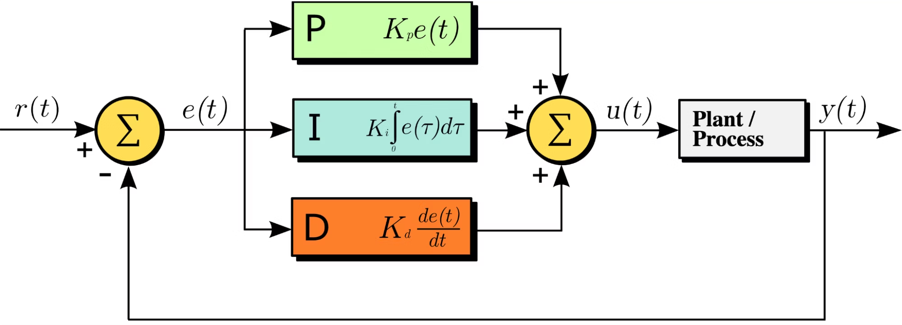

# PID

El control PID es la técnica de control más utilizada en la industria; la sigla PID significa "proporcional, integral y derivativo". 

Los controladores PID representan un mecanismo de retroalimentación sofisticado y vital para controlar sistemas dinámicos. En su núcleo, operan utilizando tres términos básicos: Proporcional (P), Integral (I) y Derivativo (D). Cada término modula de manera única la señal de salida en función de la diferencia entre el punto de ajuste deseado y el valor medido real, comúnmente conocido como el error.

El término Proporcional (P) responde al error presente, generando una salida proporcional a su magnitud. Al aplicar una acción correctiva inmediata, el término P minimiza rápidamente los errores.

El término Integral (I) aborda cualquier error persistente o desviaciones a largo plazo del punto de ajuste acumulando el error a lo largo del tiempo. Al integrar la señal de error, el término I asegura que el sistema se acerque y mantenga el punto de ajuste con precisión, eliminando los errores en estado estacionario.

El término Derivativo (D) anticipa cambios futuros en el error evaluando su tasa de cambio. Este enfoque amortigua las oscilaciones y estabiliza el sistema, especialmente durante las respuestas transitorias.

mas info https://dewesoft.com/es/blog/que-es-un-controlador-pid

gran video en el link https://platzi.com/tutoriales/1178-scikit/1895-control-clasico-de-trayectoria-de-un-vehiculo-autonomo-control-pid-aplicado-a-simulador-en-python/